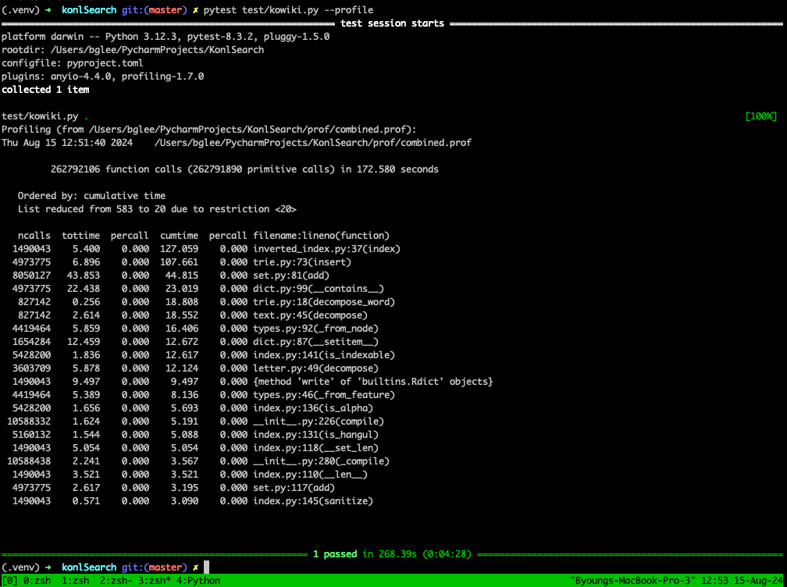

# KonlSearch: Korean Natural Language Search Engine


This project aims to implement a minimal database that can be used as an embedded search engine.

## Quickstart

```python
>>> from konlsearch.search import KonlSearch
>>> from konlsearch.inverted_index import TokenSearchMode
>>> ks = KonlSearch("./test-db")
>>> index = ks.index("animation_title") # similar to creating DB
>>> # KonlIndex.index() is like inserting into DB
>>> index.index("귀환자의 마법은 특별해야 합니다")
1 # A document is indexed with id=1
>>> index.index("마법소녀 따위는 이제 됐으니까.")
2
>>> index.index("일찍이 마법소녀와 악은 적대하고 있었다.")
3
>>> index.search(["마법"], TokenSearchMode.OR)
[1] # "마법" is indexed in document 1
>>> index.search(["마법소녀"], TokenSearchMode.OR)
[2, 3] # "마법소녀" is indexed in document 2, 3
>>> index.search(["마법소녀", "적대"], TokenSearchMode.AND) # matches only documents that have both "마법소녀" and "적대"
[3]
>>> index.get(2)
{'id': 2, 'document': '마법소녀 따위는 이제 됐으니까.'}
>>> index.get_all()
[{'id': 1, 'document': '귀환자의 마법은 특별해야 합니다'}, {'id': 2, 'document': '마법소녀 따위는 이제 됐으니까.'}, {'id': 3, 'document': '일찍이 마법소녀와 악은 적대고 있었다.'}]
>>> index.search_suggestions("ㅈ") # searches all tokens that begin with 'ㅈ', useful for autocomplete
['적대', '적대하고']
>>> ks.close()
>>> ks.destroy() # deletes DB
```

## Usage

More internal and advanced usages can be found under [test/test_konlsearch.py](test/test_konlsearch.py)


## Benchmark
- It takes about 280s to index the entire database of Korean Wikipedia titles (~30MB) on Apple M1 Max 2021 with 32GB RAM.
  - You can download the dump file from [the official Wikipedia database page](https://ko.wikipedia.org/wiki/%EC%9C%84%ED%82%A4%EB%B0%B1%EA%B3%BC:%EB%8D%B0%EC%9D%B4%ED%84%B0%EB%B2%A0%EC%9D%B4%EC%8A%A4_%EB%8B%A4%EC%9A%B4%EB%A1%9C%EB%93%9C). (kowiki-20240801-all-titles-in-ns0.gz)
  - It expands to 200MB after indexing with the default RocksDB configurations.



## Limitations
- Currently, a write lock on the entire index is acquire when indexing a document. RocksDB's WriteBatch may be used to overcome this issue, but it may or may not be implemented in the near future.

## Acknowledgements

- KonlSearch relies on [python-mecab-ko](https://github.com/jonghwanhyeon/python-mecab-ko) for tokenizing and [hangul-toolkit](https://github.com/bluedisk/hangul-toolkit) for decomposing Korean characters into consonants and vowels.
- [RocksDB](https://github.com/facebook/rocksdb) is used as a storage engine and [RocksDict](https://github.com/Congyuwang/RocksDict) for RockDB Python binding

## License

- [Apache-2.0](LICENSE)
